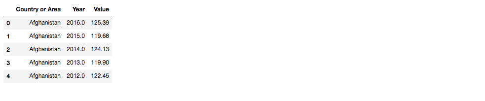

# Classification of countries based on Time Sereis data
The goal of the project was to leverage data mining techniques to identify which factors contribute in development of country. These factors such as literacy rate, infant mortality rate, agriculture production index etc. are used to classify whether the country is developed or developing.

## Methodology

### Dataset Used:
 * Different datasets were selected from http://data.un.org/Explorer.aspx , the repo contains transformed csv files.
 * Following is sample of how does data looks. This is data of agriculture production index number know PIN for various countries over the years. This dataset contains data for 252 countries. <href = "http://data.un.org/Data.aspx?d=FAO&f=itemCode%3a2051">Click here to look actual data</href>
 
      
