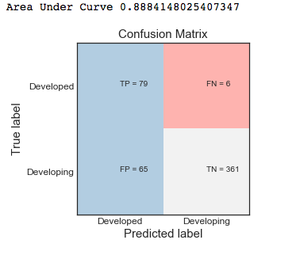

# Classification of countries based on Time Sereis data
The goal of the project was to leverage data mining techniques to identify which factors contribute in development of country. These factors such as literacy rate, infant mortality rate, agriculture production index etc. are used to classify whether the country is developed or developing. Evaluated different economic and demographic predictors and came up with the ones that have the most effect in measuring the development of a country. Combined all the predictors and built a model that will predict if a country is developing or developed.

#### Dataset Used
 * The dataset contains time series data and captures the statistics of countries for different years. However, the datasets are not consistent in terms of countries and years. In other words, one dataset might have different set of countries and data from 1960-2014 while some other might have different set of countries and data from 2011-2017
 * Different datasets were selected from http://data.un.org/Explorer.aspx , the repo contains transformed csv files.
 * Following is sample of how does data looks. This is data of agriculture production index number know PIN for various countries over the years. This dataset contains data for 252 countries.
 
      

 * Table of selected datasets
 
     

#### Data Preprocessing and Feature Extraction

**Data transformation**
  * Some of the datasets listed above were multivariant time series dataset.
  * For instance, number of employed populations was divided among Females employed in rural area, Females employed in urban area, male employed in rural area and male employed in urban area for each year, converted the dataset into univariant by summing and the values into a single value total employed population

**Feature Scaling**
  * Used Min-Max Normalization to scale down the values between 0 and 1

**Feature Extraction**
  * Since we were dealing with the time series dataset some feature engineering was required that captures the characteristics of the whole timeseries. The new features would then be used to describe the time series.
  * Used external python library tsfresh to extract features.
  * Data after feature extraction using tsfresh library.
 
     
 * Understanding how tsfresh works?
 
     It plots graph of taking time x axis vs values on y axis and for this graph calculates features of graph such as maximum amplitude, number of peaks, median, mode etc.. and we use these features for each country to build classifier.
     
     
     
**Sampling** 
  * The number of developed countries were around 35 and developing countries were around 200,hence the dataset was highly imbalanced.
  * Tried the following sampling techniques to handle imbalanced dataset:
     * SMOTE Sampling
     * SMOTE + TOMEK Sampling
     * SMOTE + EEN Sampling
     * Random Under Sampling
     
#### Building the predictive Model

  * Treated the problem as classification problem. Following steps were perfoormed to train, test and evaluate the model.
  * All the developed countries were labeled as 0 and developing countries as 1.
  * The data was split into training and testing datasets.
  * The model was then trained using ExtraTree classifier which gave the best results.
  * Used the sklearn library to implement the ExtraTree classifier algorithm.
  * After experimenting with different number of estimators and max features for the classifier, it was fined tuned to 300 estimators and 300 max features.
  * The model was tested on the test dataset by predicting if a country is 0 (developed) or 1(developing).
  * For model evaluation used Area Under Curve as data was highly imbalanced.
  
#### Combinig different datasets to retrain the Model
  * The prediction model described in the above step was trained and tested for every dataset mentioned in the Dataset Selected section.Selected all the datasets that gave the best performance. The below table shows the result (Area Under Curve) of best performing algorithm for 15 datasets we tried. Algorithms tried were SVM, Logistic Regression, Decision Tree, Bagging Classifier, Random Forest, ExtraTree Classifier.
  

     
  * Highlighted datasets were merged together, and the predictive model was re-trained and re-tested on the combined dataset.
  
#### Results
  * **Below is the graph that show fine tunning for Extratree classifier which gave best results.**
  
  
  
  * **Area under Curve and Confusion Matrix**
  
  
  
#### Experiments
  * Tried Various clustering technique to check if we can cluster developed and developing countries in different clusters.
  * This is how data looks for agriculture dataset.
  
  
  
  * As we can see data is overlapped it is difficult to cluster them with these features. These can be the feature scope which all of us can try and extract some different features which can give good clustering results. Please feel free to contact me on nikhil.agrawal005@gmail.com for any help or assistance needed.
  
#### References
  * https://tsfresh.readthedocs.io/en/latest/text/forecasting.html
  * https://scikit-learn.org/stable/
  * https://imbalanced-learn.readthedocs.io/en/stable/over_sampling.html
